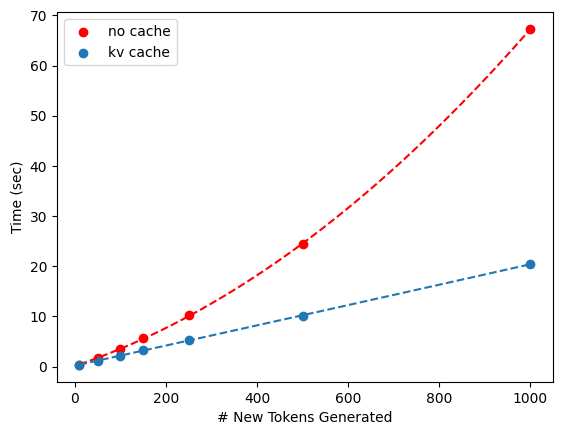

# minLlama2

minLlama2 is a simple implementation of Meta's Llama2 model for finetuning, drawing on HuggingFace and Karpathy's minGPT.

You can use it to finetune Llama2 7B on a single A100 without quantization or LoRA. Works great inside a Jupyter notebook.




## Key Features

- **Easy end-to-end batch generation**: input a list of strings, get out a list of strings; automatically stop at EOS
- **JSONL dataloader**: comes with PyTorch data loader for JSONL datasets
- **Prompt templates**: apply different prompt templates without changing the underlying dataset
- **Finetuning script**: easy-to-use finetuning logic for JSONL training data


## Example

``` python
from model import LlamaModel
from templates import PromptTemplateCollection

model = LlamaModel.from_pretrained("./models/samsum_finetune.pth", use_cache=True)

dialog = (
        "A: How's it going?" +
    "\r\nB: Great, I got promoted today!" +
    "\r\nA: Let's go out and celebrate." +
    "\r\nB: Good idea, let's go."
)

model.generate(
    [
        PromptTemplateCollection['summarize'].format(dialog)
    ], 
    max_new_tokens=100, 
    output_only=True
)
```

**Output:** ['B got promoted today. A and B will go out to celebrate.']


## Installation

For now, consult `demo.ipynb` to get started. A Python package with proper installation is coming soon.
